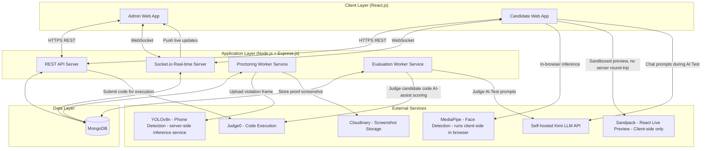
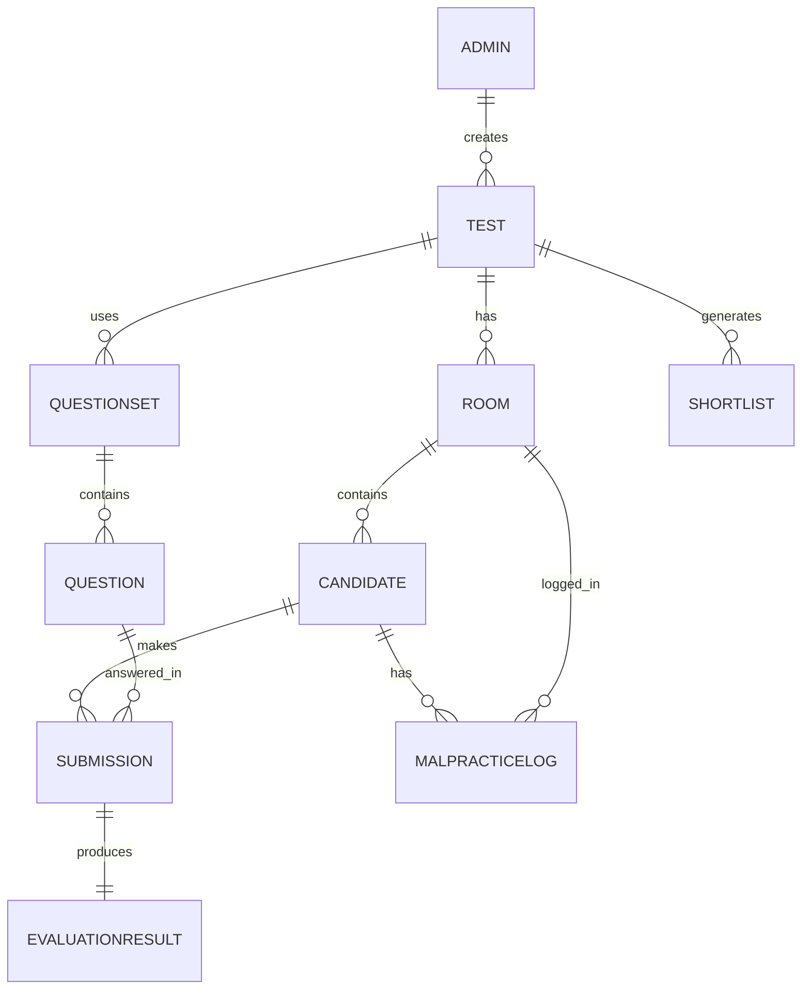
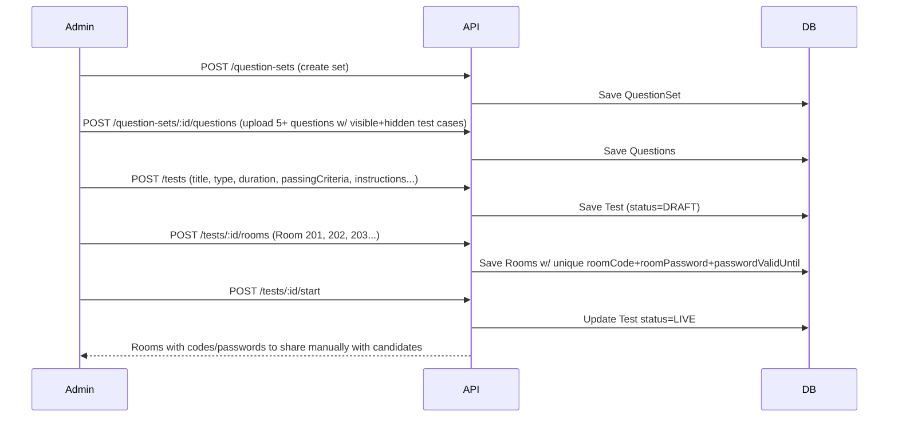
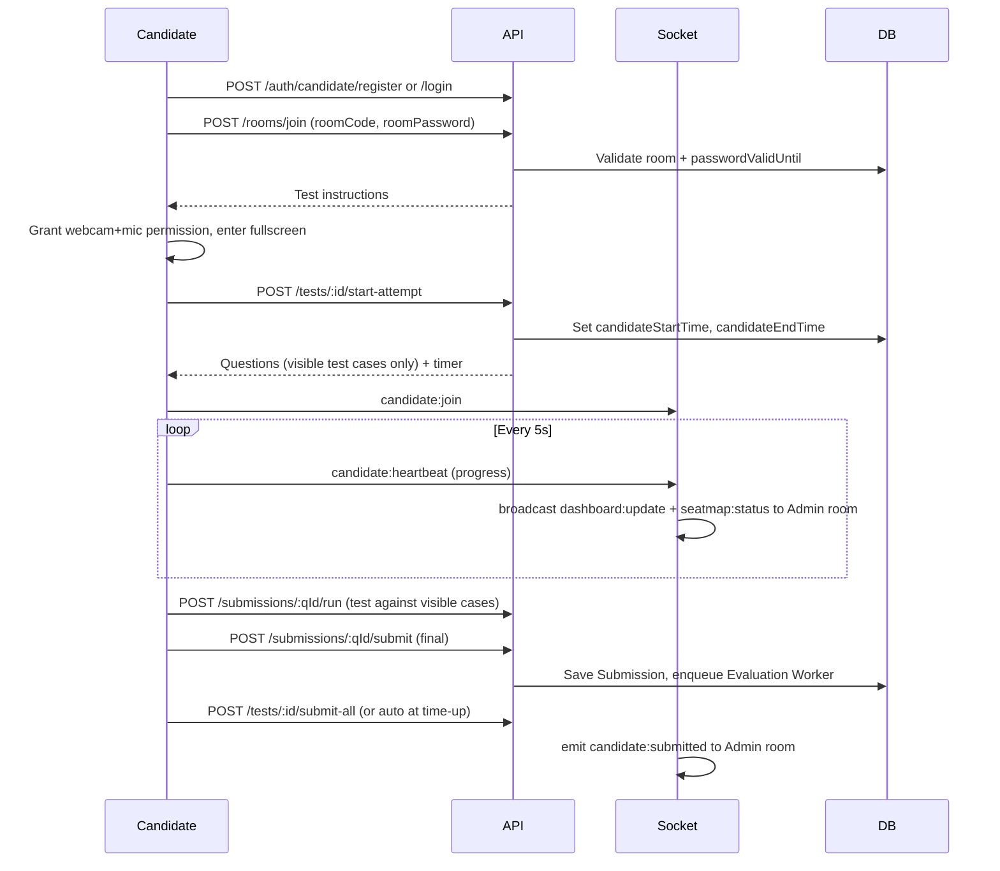
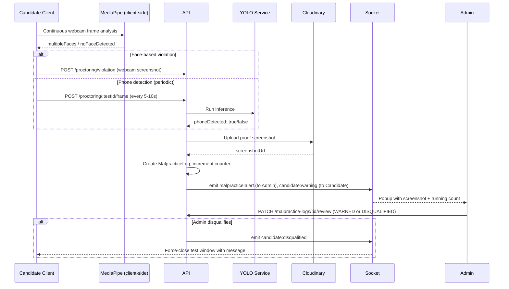
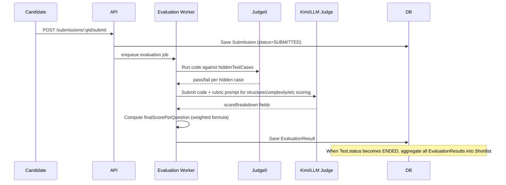
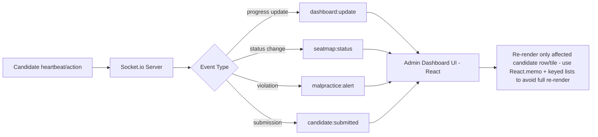

# Product Requirements Document (PRD)
# AI Proctored Test Platform

**Prepared for:** Globussoft Technology
**Address:** 1st Floor, Uday Mansion, Koramangala Industrial Layout, Koramangala, Bengaluru
**Document Type:** Engineering Build Specification (PRD + Technical Design combined)
**Intended Consumer:** AI coding agent (e.g., Antigravity / Gemini) for autonomous full-stack implementation, and human engineering reviewers
**Stack:** MERN (MongoDB, Express.js, React.js, Node.js) + Socket.io
**Version:** 1.0
**Status:** Approved for build

---

## 0. How to Use This Document (Instructions for the Building AI Agent)

This document is written to be executed literally, not interpreted loosely. Follow these rules:

1. **Do not invent features, fields, endpoints, or flows not specified here.** If something is ambiguous, prefer the most restrictive/explicit interpretation given in this document, and flag it in code comments as `// ASSUMPTION:` rather than silently deciding.
2. **Every schema field, API endpoint, and Socket.io event listed below is exact.** Field names, types, and casing must be used as-is (camelCase for JS/JSON, exactly as written).
3. **Section 8 (Database Schema), Section 9 (API Spec), and Section 10 (Socket.io Events) are the source of truth for implementation.** Sections 1–7 and 11–16 provide context, business logic, and non-functional constraints — implement against them, but when in doubt, the explicit schemas/specs win.
4. **All acceptance criteria in Section 11 must be satisfied** before a module is considered complete.
5. Items marked `[PENDING - PLACEHOLDER]` are known unknowns (e.g., Kimi API credentials, production server details). Build the integration point/interface for these using environment variables (Section 7.3) so they can be swapped in without code changes.
6. Follow the **folder structure in Section 7.2** exactly to keep the codebase predictable.

---

## 1. Project Overview

### 1.1 Purpose
Globussoft Technology conducts large-scale hiring drives (200–300 candidates at once) using coding/DSA elimination rounds. Currently this is logistically difficult to proctor and evaluate manually. This platform automates: test creation, multi-room candidate management, AI-assisted proctoring, automated code evaluation, and live monitoring — for internal hiring use only (not a multi-tenant SaaS product).

### 1.2 Goals
- Allow admins to create and run coding tests (SPOJ, React, JavaScript, AI Test types) across multiple physical rooms simultaneously.
- Automatically detect malpractice via webcam and browser behavior, and surface it to admins in real time.
- Automatically evaluate candidate code (correctness, complexity, structure, etc.) and generate ranked shortlists.
- Provide a live, low-latency monitoring dashboard and seat map for admins during the test.
- Support a distinct "AI Test" mode where candidates use an AI chat assistant (Kimi, self-hosted) to help build a small project, and are scored primarily on prompt quality.

### 1.3 Non-Goals (v1)
- No MCQ/theory question support (planned for future phase).
- No AI-based automatic question generation (planned for future phase; admin uploads questions manually in v1).
- No multi-tenant support — single organization use only.
- No full-length video recording/storage — only violation screenshots are stored.
- No automated candidate notification (shortlist/rejection emails) — handled manually by HR outside the platform.

### 1.4 Users
| Role | Description |
|---|---|
| **Super Admin** | Full control. Only role that can create/manage other Admin accounts. |
| **Admin** | Creates/manages tests, rooms, question uploads, live monitoring, malpractice review, evaluation threshold changes. Cannot create other admins. |
| **Candidate** | Self-registers (account expires automatically after 3 days), joins a test via Room ID/Password, takes the test under proctoring. |

---

## 2. High-Level Architecture



### 2.1 Component Responsibilities
- **REST API Server**: CRUD for tests, rooms, questions, users, submissions, reports.
- **Socket.io Server**: Live dashboard updates, seat map status, malpractice alerts, timer sync, submission announcements.
- **Proctoring Worker**: Receives periodic frames/events from candidate client, runs YOLOv8n phone-detection inference server-side, logs violations, triggers Cloudinary upload + Socket.io alert.
- **Evaluation Worker**: Runs after code submission — orchestrates Judge0 execution against hidden test cases, computes weighted score, and (for AI Test) calls Kimi/LLM-based judging on prompt logs.
- **MediaPipe**: Runs **client-side in the browser** (via `@mediapipe/tasks-vision` or TensorFlow.js) for face presence/multiple-face detection to minimize latency and server load; violation events are sent to the server via REST/Socket.io when detected.
- **YOLOv8n**: Runs **server-side** as a small inference microservice (Flask/FastAPI, called from Node backend) since it's heavier — candidate client periodically POSTs snapshots (e.g., every 5–10 seconds) for phone detection.

---

## 3. User Roles & Permissions Matrix

| Action | Super Admin | Admin | Candidate |
|---|---|---|---|
| Create/delete Admin accounts | ✅ | ❌ | ❌ |
| Create/edit/delete Test | ✅ | ✅ | ❌ |
| Upload question sets | ✅ | ✅ | ❌ |
| Create/add/remove Rooms | ✅ | ✅ | ❌ |
| View live dashboard & seat map | ✅ | ✅ | ❌ |
| Manually disqualify candidate | ✅ | ✅ | ❌ |
| Change passing criteria (during/after test) | ✅ | ✅ | ❌ |
| View/download reports & shortlist | ✅ | ✅ | ❌ |
| Register account | ❌ (not applicable) | ❌ | ✅ |
| Join test via Room ID/Password | ❌ | ❌ | ✅ |
| Take test, use compiler/AI chat | ❌ | ❌ | ✅ |

---

## 4. Core Functional Modules

1. Authentication & Account Management
2. Test Management (Admin)
3. Room Management (Admin)
4. Question Bank Management (Admin)
5. Candidate Test-Taking Experience (Standard Coding: SPOJ/React/JS)
6. Candidate Test-Taking Experience (AI Test)
7. Live Proctoring & Malpractice Detection
8. Live Monitoring Dashboard & Seat Map (Admin)
9. Evaluation Engine
10. Reports & Shortlisting

Each module's detailed functional requirements and acceptance criteria are in Section 11.

---

## 5. Tech Stack

| Layer | Technology |
|---|---|
| Frontend | React.js (with React Router, Context API or Redux Toolkit for state) |
| Backend | Node.js + Express.js |
| Database | MongoDB (Mongoose ODM) |
| Real-time | Socket.io |
| Code Execution | Judge0 (self-hosted via Docker, open-source, free) — Python, Java, C++, C, JavaScript |
| React Live Preview (AI Test) | Sandpack (`@codesandbox/sandpack-react`) — client-side, no server execution needed |
| AI Test LLM | Organization's self-hosted Kimi model, accessed via REST API `[PENDING - PLACEHOLDER]` |
| Face/Multi-face Detection | MediaPipe Tasks Vision (`@mediapipe/tasks-vision`), client-side in browser |
| Phone Detection | YOLOv8n (Ultralytics, open-source), server-side Python microservice |
| Screenshot Storage | Cloudinary (free tier) |
| Authentication | JWT (access + refresh tokens), bcrypt for password hashing |
| PDF Generation (shortlist export) | `pdfkit` or `puppeteer` (Node) |
| Deployment | Organization's own server `[PENDING - PLACEHOLDER: exact infra TBD]` — build with Docker Compose so it is infra-agnostic (can run on any VM/cloud) |

---

## 6. Assumptions & Placeholders

| Item | Assumption / Placeholder |
|---|---|
| Kimi API | Accessed via `KIMI_API_BASE_URL` and `KIMI_API_KEY` env vars. Assume it exposes an OpenAI-compatible chat completion endpoint (`POST /v1/chat/completions`). If the actual API differs, only the Kimi service adapter module (`/server/services/kimiService.js`) needs to change — isolate all Kimi-specific logic there. |
| Deployment infra | Unknown at build time. Build with Docker Compose (`docker-compose.yml` covering: frontend, backend, MongoDB, Judge0, YOLO inference service) so it can be deployed to any server later without rework. |
| Max concurrent candidates | 300 (design Socket.io rooms and DB indexes with this scale in mind; not "webscale" but must not degrade under this load). |
| Test case format | Each question's hidden/visible test cases are plain input/output string pairs compatible with Judge0's stdin/stdout execution model. |

---

## 7. Project Structure, Environment Variables, and Setup

### 7.1 Repository Structure (Monorepo)

```
ai-proctored-test-platform/
├── client/                        # React frontend
│   ├── src/
│   │   ├── admin/                 # Admin panel components/pages
│   │   ├── candidate/             # Candidate panel components/pages
│   │   ├── shared/                # Shared components (buttons, modals, etc.)
│   │   ├── hooks/
│   │   ├── services/               # API client, socket client
│   │   ├── proctoring/             # MediaPipe integration, webcam capture
│   │   ├── styles/                 # Globussoft theme (Section 14)
│   │   └── App.jsx
│   └── package.json
├── server/                        # Node/Express backend
│   ├── src/
│   │   ├── controllers/
│   │   ├── models/                 # Mongoose schemas (Section 8)
│   │   ├── routes/                 # Express routes (Section 9)
│   │   ├── sockets/                 # Socket.io event handlers (Section 10)
│   │   ├── services/
│   │   │   ├── judge0Service.js
│   │   │   ├── kimiService.js
│   │   │   ├── cloudinaryService.js
│   │   │   ├── evaluationService.js
│   │   │   └── malpracticeService.js
│   │   ├── middleware/             # authMiddleware, roleMiddleware
│   │   ├── workers/                 # evaluationWorker.js, proctoringWorker.js
│   │   └── app.js
│   └── package.json
├── yolo-service/                  # Python microservice for phone detection
│   ├── app.py                      # FastAPI/Flask app
│   ├── model/yolov8n.pt
│   └── requirements.txt
├── docker-compose.yml
├── .env.example
└── README.md
```

### 7.2 Environment Variables (`.env.example`)

```
# Server
PORT=5000
NODE_ENV=production
CLIENT_URL=https://your-domain.com

# MongoDB
MONGODB_URI=mongodb://localhost:27017/ai_proctored_test_platform

# JWT
JWT_ACCESS_SECRET=change_me
JWT_REFRESH_SECRET=change_me
JWT_ACCESS_EXPIRY=15m
JWT_REFRESH_EXPIRY=7d

# Judge0
JUDGE0_API_URL=http://localhost:2358
JUDGE0_API_KEY=

# Kimi LLM (self-hosted) [PENDING - PLACEHOLDER]
KIMI_API_BASE_URL=
KIMI_API_KEY=

# Cloudinary
CLOUDINARY_CLOUD_NAME=
CLOUDINARY_API_KEY=
CLOUDINARY_API_SECRET=

# YOLO phone-detection microservice
YOLO_SERVICE_URL=http://localhost:8001

# Candidate account expiry (in days)
CANDIDATE_ACCOUNT_EXPIRY_DAYS=3

# Socket.io
SOCKET_CORS_ORIGIN=https://your-domain.com
```

---

## 8. Database Schema (MongoDB / Mongoose)

### 8.1 Entity Relationship Diagram



### 8.2 Collections

#### `Admin`
```js
{
  _id: ObjectId,
  name: String, required,
  email: String, required, unique, lowercase,
  passwordHash: String, required,
  role: { type: String, enum: ["SUPER_ADMIN", "ADMIN"], required },
  createdBy: { type: ObjectId, ref: "Admin", default: null }, // null for the first super admin
  isActive: { type: Boolean, default: true },
  createdAt: Date,
  updatedAt: Date
}
```

#### `Candidate`
```js
{
  _id: ObjectId,
  name: String, required,
  email: String, required, unique, lowercase,
  phone: String,
  passwordHash: String, required,
  createdAt: { type: Date, default: Date.now },
  expiresAt: { type: Date, index: { expires: 0 } }, // TTL index = createdAt + CANDIDATE_ACCOUNT_EXPIRY_DAYS, MongoDB auto-deletes document at this time
  isDisqualified: { type: Boolean, default: false }
}
```
> **Note for AI agent**: Use a MongoDB TTL index on `expiresAt` so accounts are automatically purged after 3 days without a cron job.

#### `Test`
```js
{
  _id: ObjectId,
  title: String, required,
  testType: { type: String, enum: ["SPOJ", "REACT", "JAVASCRIPT", "AI_TEST"], required },
  createdBy: { type: ObjectId, ref: "Admin", required },
  questionSetId: { type: ObjectId, ref: "QuestionSet", required },
  durationMinutes: { type: Number, required },
  totalQuestions: { type: Number, required, default: 5 },
  passingCriteria: { type: Number, required }, // e.g., 2.5 (out of totalQuestions)
  instructions: { type: String, required }, // rich text shown before test start
  startTestWindowMinutes: { type: Number, required, default: 10 }, // room ID/pass validity window
  supportedLanguages: [{ type: String, enum: ["python", "java", "cpp", "c", "javascript", "react"] }],
  malpracticeDisqualifyThreshold: { type: Number, default: null }, // set post-exam by admin; null = not yet set
  status: { type: String, enum: ["DRAFT", "SCHEDULED", "LIVE", "ENDED"], default: "DRAFT" },
  createdAt: Date,
  updatedAt: Date
}
```

#### `Room`
```js
{
  _id: ObjectId,
  testId: { type: ObjectId, ref: "Test", required },
  roomName: { type: String, required }, // e.g., "Room 201"
  roomCode: { type: String, required, unique }, // auto-generated join ID
  roomPassword: { type: String, required }, // auto-generated
  passwordValidUntil: { type: Date, required }, // createdAt + startTestWindowMinutes
  capacity: { type: Number },
  status: { type: String, enum: ["ACTIVE", "CLOSED"], default: "ACTIVE" },
  createdAt: Date
}
```

#### `QuestionSet`
```js
{
  _id: ObjectId,
  testType: { type: String, enum: ["SPOJ", "REACT", "JAVASCRIPT", "AI_TEST"], required },
  name: String, required,
  createdBy: { type: ObjectId, ref: "Admin", required },
  questionIds: [{ type: ObjectId, ref: "Question" }], // pool this set draws from
  createdAt: Date
}
```

#### `Question`
```js
{
  _id: ObjectId,
  questionSetId: { type: ObjectId, ref: "QuestionSet", required },
  testType: { type: String, enum: ["SPOJ", "REACT", "JAVASCRIPT", "AI_TEST"], required },
  title: String, required,
  description: String, required, // full problem statement / AI-test project brief
  difficulty: { type: String, enum: ["EASY", "MEDIUM", "HARD"] },
  inputFormat: String,
  outputFormat: String,
  constraints: String, // valid input range, used to catch hardcoding
  visibleTestCases: [{ input: String, expectedOutput: String }], // shown to candidate
  hiddenTestCases: [{ input: String, expectedOutput: String }],  // used only for correctness scoring
  // AI_TEST specific fields (null/unused for other types):
  aiTestBriefFiles: [{ fileName: String }], // e.g., ["index.html", "style.css"] starter files
  createdAt: Date
}
```

#### `Submission`
```js
{
  _id: ObjectId,
  candidateId: { type: ObjectId, ref: "Candidate", required },
  testId: { type: ObjectId, ref: "Test", required },
  roomId: { type: ObjectId, ref: "Room", required },
  questionId: { type: ObjectId, ref: "Question", required },
  code: String, // final submitted code (or file map JSON for AI Test)
  filesJson: { type: Object, default: null }, // for AI Test: { "index.html": "...", "style.css": "..." }
  language: String,
  promptLog: [{ role: { type: String, enum: ["candidate", "ai"] }, message: String, timestamp: Date }], // AI Test only
  visibleTestCasesPassed: { type: Number, default: 0 },
  visibleTestCasesTotal: { type: Number, default: 0 },
  hiddenTestCasesPassed: { type: Number, default: 0 },
  hiddenTestCasesTotal: { type: Number, default: 0 },
  candidateStartTime: Date, // individual timer start
  candidateEndTime: Date,
  submittedAt: Date,
  status: { type: String, enum: ["IN_PROGRESS", "SUBMITTED", "AUTO_SUBMITTED_TIME_UP", "AUTO_SUBMITTED_DISQUALIFIED"], default: "IN_PROGRESS" }
}
```

#### `EvaluationResult`
```js
{
  _id: ObjectId,
  submissionId: { type: ObjectId, ref: "Submission", required, unique },
  candidateId: { type: ObjectId, ref: "Candidate", required },
  testId: { type: ObjectId, ref: "Test", required },
  scoreBreakdown: {
    codeCorrectness: Number,      // 30%
    testCasePassPercent: Number,  // 10%
    timeComplexity: Number,       // 15%
    spaceComplexity: Number,      // 10%
    codeStructure: Number,        // 10%
    problemSolvingApproach: Number, // 8%
    exceptionHandling: Number,    // 8%
    inputValidation: Number,      // 5%
    codeOptimization: Number,     // 2%
    linesOfCode: Number,          // 2%
    // AI Test only:
    promptQuality: Number,        // 60%
    outputCorrectnessDesign: Number // 40%
  },
  finalScorePerQuestion: Number, // 0-10 or 0-1 scale, defined consistently
  questionsCompletedCount: Number, // e.g., 2.5 — used for live progress + passing criteria check
  isPassed: Boolean, // computed against Test.passingCriteria
  evaluatedAt: Date
}
```

#### `MalpracticeLog`
```js
{
  _id: ObjectId,
  candidateId: { type: ObjectId, ref: "Candidate", required },
  testId: { type: ObjectId, ref: "Test", required },
  roomId: { type: ObjectId, ref: "Room", required },
  violationType: { type: String, enum: ["PHONE_DETECTED", "MULTIPLE_FACES", "NO_FACE_15MIN", "TAB_SWITCH", "FULLSCREEN_EXIT", "OTHER"], required },
  proofScreenshotUrl: String, // Cloudinary URL (webcam or screen capture depending on violationType)
  detectedAt: { type: Date, default: Date.now },
  adminReviewed: { type: Boolean, default: false },
  adminAction: { type: String, enum: ["NONE", "WARNED", "DISQUALIFIED"], default: "NONE" },
  reviewedBy: { type: ObjectId, ref: "Admin", default: null },
  reviewedAt: Date
}
```

#### `Shortlist`
```js
{
  _id: ObjectId,
  testId: { type: ObjectId, ref: "Test", required, unique },
  passingCriteriaUsed: Number, // snapshot of the threshold at generation time
  malpracticeThresholdUsed: Number,
  candidates: [{
    candidateId: { type: ObjectId, ref: "Candidate" },
    name: String,
    email: String,
    score: Number,
    questionsCompleted: Number,
    malpracticeCount: Number,
    rank: Number
  }],
  generatedAt: Date
}
```

### 8.3 Indexes (required for 300-concurrent-candidate scale)
- `Candidate.email` — unique
- `Candidate.expiresAt` — TTL index
- `Room.roomCode` — unique
- `Submission`: compound index on `{ candidateId, testId, questionId }`
- `MalpracticeLog`: compound index on `{ testId, roomId, candidateId }`
- `EvaluationResult.submissionId` — unique

---

## 9. REST API Specification

Base URL: `/api/v1`
Auth: `Authorization: Bearer <JWT>` header on all routes except `/auth/*`.

### 9.1 Auth
| Method | Endpoint | Body | Response | Notes |
|---|---|---|---|---|
| POST | `/auth/admin/login` | `{ email, password }` | `{ token, refreshToken, admin: {id, name, role} }` | |
| POST | `/auth/admin/create` | `{ name, email, password, role }` | `{ admin }` | Super Admin only (role middleware) |
| POST | `/auth/candidate/register` | `{ name, email, password, phone }` | `{ candidate, token }` | Sets `expiresAt = now + 3 days` |
| POST | `/auth/candidate/login` | `{ email, password }` | `{ candidate, token }` | 401 if account expired/deleted |
| POST | `/auth/refresh` | `{ refreshToken }` | `{ token }` | |
| POST | `/auth/logout` | — | `{ success: true }` | |

### 9.2 Test Management (Admin/Super Admin)
| Method | Endpoint | Body | Response |
|---|---|---|---|
| POST | `/tests` | `{ title, testType, questionSetId, durationMinutes, totalQuestions, passingCriteria, instructions, startTestWindowMinutes, supportedLanguages }` | `{ test }` |
| GET | `/tests` | — | `{ tests: [] }` |
| GET | `/tests/:testId` | — | `{ test }` |
| PATCH | `/tests/:testId` | any editable field | `{ test }` |
| PATCH | `/tests/:testId/passing-criteria` | `{ passingCriteria }` | `{ test }` — **triggers shortlist regeneration if test has ended (see 9.7)** |
| PATCH | `/tests/:testId/malpractice-threshold` | `{ malpracticeDisqualifyThreshold }` | `{ test, updatedShortlist }` |
| DELETE | `/tests/:testId` | — | `{ success: true }` |
| POST | `/tests/:testId/start` | — | `{ test }` — sets status to `LIVE` |
| POST | `/tests/:testId/end` | — | `{ test }` — sets status to `ENDED`, triggers final evaluation pass |

### 9.3 Room Management
| Method | Endpoint | Body | Response |
|---|---|---|---|
| POST | `/tests/:testId/rooms` | `{ roomName, capacity }` | `{ room }` — auto-generates `roomCode`, `roomPassword`, `passwordValidUntil` |
| GET | `/tests/:testId/rooms` | — | `{ rooms: [] }` |
| DELETE | `/rooms/:roomId` | — | `{ success: true }` — allowed even if test is LIVE |
| GET | `/rooms/:roomId/candidates` | — | `{ candidates: [] }` |

### 9.4 Question Bank
| Method | Endpoint | Body | Response |
|---|---|---|---|
| POST | `/question-sets` | `{ testType, name }` | `{ questionSet }` |
| POST | `/question-sets/:setId/questions` | `{ title, description, difficulty, inputFormat, outputFormat, constraints, visibleTestCases[], hiddenTestCases[] }` | `{ question }` |
| GET | `/question-sets/:setId/questions` | — | `{ questions: [] }` (hiddenTestCases excluded from response unless requester is Admin) |
| PATCH | `/questions/:questionId` | any field | `{ question }` |
| DELETE | `/questions/:questionId` | — | `{ success: true }` |

### 9.5 Candidate Test-Taking
| Method | Endpoint | Body | Response |
|---|---|---|---|
| POST | `/rooms/join` | `{ roomCode, roomPassword }` | `{ test, room, instructions }` — 403 if `now > passwordValidUntil` |
| POST | `/tests/:testId/start-attempt` | — | `{ submissionSessionId, candidateStartTime, candidateEndTime, questions[] }` — sets individual timer |
| GET | `/tests/:testId/questions/:questionId` | — | `{ question }` (visibleTestCases only) |
| POST | `/submissions/:questionId/run` | `{ code, language, customInput? }` | `{ output, visibleTestResults[] }` — proxies to Judge0, does NOT persist |
| POST | `/submissions/:questionId/save` | `{ code, language }` | `{ success: true, savedAt }` — autosave, no evaluation |
| POST | `/submissions/:questionId/submit` | `{ code, language }` | `{ submission }` — final submit, triggers evaluation worker |
| POST | `/tests/:testId/submit-all` | — | `{ success: true }` — final full-test submit (or auto-triggered at time-up) |

### 9.6 AI Test Specific
| Method | Endpoint | Body | Response |
|---|---|---|---|
| POST | `/ai-test/:questionId/chat` | `{ message }` | `{ reply }` — proxies to Kimi, appends to `promptLog` |
| POST | `/ai-test/:questionId/save-files` | `{ filesJson }` | `{ success: true }` |
| POST | `/ai-test/:questionId/submit` | `{ filesJson, promptLog }` | `{ submission }` |
| GET | `/ai-test/:questionId/preview` | — | `{ previewBundle }` — data handed to Sandpack on client (rendered client-side, not server-rendered) |

### 9.7 Evaluation & Reports (Admin)
| Method | Endpoint | Body | Response |
|---|---|---|---|
| GET | `/tests/:testId/results` | — | `{ results: [] }` (per-candidate scores) |
| GET | `/tests/:testId/shortlist` | — | `{ shortlist }` |
| POST | `/tests/:testId/shortlist/regenerate` | — | `{ shortlist }` — manual trigger (also auto-triggered by 9.2 PATCH endpoints) |
| GET | `/tests/:testId/shortlist/export-pdf` | — | PDF file stream |
| GET | `/submissions/:submissionId/copy-paste-log` | — | `{ events: [] }` |

### 9.8 Proctoring / Malpractice
| Method | Endpoint | Body | Response |
|---|---|---|---|
| POST | `/proctoring/:testId/frame` | `multipart/form-data: image` | `{ phoneDetected: Boolean }` — sent every 5–10s by candidate client, runs YOLOv8n |
| POST | `/proctoring/violation` | `{ candidateId, testId, roomId, violationType, screenshotBase64 }` | `{ malpracticeLog }` — uploads to Cloudinary, creates log, emits socket event |
| PATCH | `/malpractice-logs/:logId/review` | `{ adminAction: "WARNED"|"DISQUALIFIED" }` | `{ malpracticeLog }` |

---

## 10. Socket.io Event Contracts

Namespace: default `/`. Candidates join room `test:{testId}:room:{roomId}`. Admins join room `test:{testId}:admin` (receives all rooms) and optionally `test:{testId}:room:{roomId}` for a filtered view.

### 10.1 Client → Server Events
| Event | Payload | Description |
|---|---|---|
| `candidate:join` | `{ candidateId, testId, roomId }` | Candidate socket joins test/room channel |
| `admin:join` | `{ adminId, testId }` | Admin joins full-test monitoring channel |
| `candidate:heartbeat` | `{ candidateId, testId, currentQuestionId, questionsCompleted }` | Sent every ~5s to update live dashboard/seat map |
| `candidate:tabswitch` | `{ candidateId, testId, roomId }` | Fired on `visibilitychange`/blur |
| `candidate:fullscreenexit` | `{ candidateId, testId, roomId }` | Fired on fullscreen API exit event |

### 10.2 Server → Client Events
| Event | Payload | Description |
|---|---|---|
| `dashboard:update` | `{ candidateId, name, roomId, status, questionsCompleted, timeRemaining }` | Broadcast to admins on heartbeat |
| `seatmap:status` | `{ candidateId, roomId, colorStatus: "GREEN"\|"RED"\|"YELLOW"\|"WHITE" }` | Broadcast to admins |
| `malpractice:alert` | `{ malpracticeLogId, candidateId, candidateName, roomId, violationType, proofScreenshotUrl, currentCount }` | Broadcast to admins (real-time popup) |
| `candidate:warning` | `{ violationType, message }` | Sent to the specific candidate socket to show warning popup |
| `candidate:disqualified` | `{ reason: "MANUAL"\|"MALPRACTICE_THRESHOLD" }` | Forces candidate client to lock/close test window with message |
| `candidate:submitted` | `{ candidateName }` | Broadcast to admin room — triggers AI voice announcement on admin dashboard |
| `test:ended` | `{ testId }` | Broadcast to all candidates in test — forces auto-submit |
| `room:updated` | `{ roomId, action: "ADDED"\|"REMOVED" }` | Broadcast to admins when rooms change mid-test |

---

## 11. Detailed Functional Requirements & Acceptance Criteria

### 11.1 Authentication & Account Management
- **FR-1.1**: Super Admin can create Admin accounts (name, email, password, role). *AC*: Attempting this as a non-Super-Admin returns `403`.
- **FR-1.2**: Candidate registers with name, email, phone, password. *AC*: Record created with `expiresAt = createdAt + 3 days`; login attempts after `expiresAt` return `401 Account expired, please register again`.

### 11.2 Test Management
- **FR-2.1**: Admin creates a Test by selecting type, question set, duration, total questions, passing criteria, instructions, language list, and start-test window. *AC*: Test is created in `DRAFT` status until explicitly started.
- **FR-2.2**: Admin can change `passingCriteria` at any time, including after test ends. *AC*: On change, shortlist is recalculated **immediately and automatically** (call `/shortlist/regenerate` internally) — no manual step required from admin.
- **FR-2.3**: Admin can set `malpracticeDisqualifyThreshold` only after test status is `ENDED`. *AC*: Setting this immediately re-evaluates all candidates' malpractice counts and updates `isPassed`/shortlist accordingly.

### 11.3 Room Management
- **FR-3.1**: Admin adds rooms to a test at any time (before or during LIVE status). *AC*: New room gets unique `roomCode`/`roomPassword` immediately usable.
- **FR-3.2**: Admin can remove a room even while test is LIVE. *AC*: Candidates already in that room are NOT kicked out mid-test (their session persists); only new joins to that room code are blocked.
- **FR-3.3**: `roomPassword` becomes invalid after `passwordValidUntil`. *AC*: Join attempt after this time returns `403 Room code expired`.

### 11.4 Question Bank
- **FR-4.1**: Every question must have at least 1 visible and 1 hidden test case before it can be added to a live question set. *AC*: API rejects question creation with `400` if either array is empty.
- **FR-4.2**: Hidden test cases are never returned in any candidate-facing API response. *AC*: Verify `GET /tests/:testId/questions/:questionId` response never includes `hiddenTestCases` key for candidate-authenticated requests.

### 11.5 Candidate Test-Taking (Standard Coding)
- **FR-5.1**: On `start-attempt`, `candidateStartTime = now`, `candidateEndTime = now + test.durationMinutes`. *AC*: Timer shown to candidate is calculated client-side from these two server-issued timestamps (never trust client clock alone — resync periodically via heartbeat response).
- **FR-5.2**: Full-screen is mandatory to start; exiting fullscreen fires `candidate:fullscreenexit` and captures a screen-capture screenshot as proof. *AC*: Violation logged with `violationType: "FULLSCREEN_EXIT"`.
- **FR-5.3**: Tab switch is detected and logged the same way as fullscreen exit (`violationType: "TAB_SWITCH"`), with screen-capture proof.
- **FR-5.4**: Copy-paste (Ctrl+C/Ctrl+V) and right-click are disabled in the code editor. *AC*: Browser-level event prevention (`onCopy`, `onPaste`, `onContextMenu` all call `preventDefault()`).
- **FR-5.5**: "Questions completed" progress (for live dashboard only) = sum of (visible test cases passed / visible test cases total) per question, capped at 1.0 per question. *AC*: A question with 3/5 visible test cases passing contributes `0.6` to progress count.
- **FR-5.6**: Test auto-submits when `candidateEndTime` is reached. *AC*: `test:ended`-equivalent per-candidate timeout triggers `/tests/:testId/submit-all` server-side even if candidate client is unresponsive (server-side timer, not solely client-triggered).

### 11.6 Candidate Test-Taking (AI Test)
- **FR-6.1**: Candidate writes code manually in file-tree editor (e.g., `index.html`, `style.css`); the AI chat panel only returns suggested code/text in the chat — it does **not** auto-write into the candidate's files. *AC*: `POST /ai-test/:questionId/chat` response is never programmatically inserted into `filesJson`; only candidate copy/paste (if allowed for AI test — see note) or manual typing populates files.
  > **Note**: Standard copy-paste restrictions (FR-5.4) should be **relaxed for the AI Test's chat-to-editor interaction** since the workflow assumes candidates may copy AI suggestions into their own files — but copy-paste from external sources/other apps must still be blocked. Implement copy-paste allowed only when copying *within* the AI Test interface (chat panel → code editor), blocked elsewhere. Flag this as `// ASSUMPTION` in code and confirm with stakeholder if possible.
- **FR-6.2**: Every chat message and AI reply is appended to `promptLog` with timestamp. *AC*: `promptLog` array is complete and ordered on submission — used entirely for prompt-quality scoring.
- **FR-6.3**: Preview button renders the candidate's current files via Sandpack, client-side, without a server round trip. *AC*: No new Submission record or server call is created merely by clicking Preview.

### 11.7 Proctoring & Malpractice
- **FR-7.1**: Client runs MediaPipe continuously (or at short intervals) for face presence + multiple-face detection. On violation, client calls `POST /proctoring/violation` with a webcam screenshot. *AC*: `MULTIPLE_FACES` and `NO_FACE_15MIN` violations always carry a **webcam** screenshot (not screen capture).
- **FR-7.2**: Client sends a periodic frame (every 5-10s) to `POST /proctoring/:testId/frame` for server-side YOLOv8n phone detection. *AC*: If `phoneDetected: true`, server automatically creates a `MalpracticeLog` with `violationType: "PHONE_DETECTED"` and the same frame as proof — client does not need to call `/proctoring/violation` separately for this case.
- **FR-7.3**: On any violation: (a) candidate sees a warning popup (`candidate:warning` event), (b) admin sees a popup with the screenshot (`malpractice:alert` event), (c) the candidate's malpractice counter increments and is visible beside their name on the seat map/dashboard. *AC*: All three happen within 2 seconds of detection (NFR, see Section 13).
- **FR-7.4**: Malpractice **never auto-disqualifies during the test** — only an Admin's manual action (`PATCH /malpractice-logs/:logId/review` with `adminAction: "DISQUALIFIED"`) disqualifies a candidate mid-test. *AC*: Reaching any malpractice count during a LIVE test does not, by itself, change `Candidate.isDisqualified` or close their session.
- **FR-7.5**: After test ends, Admin can set `malpracticeDisqualifyThreshold` (e.g., `>2`), and all candidates with `malpracticeCount > threshold` are marked disqualified and excluded from the shortlist. *AC*: Verified via `PATCH /tests/:testId/malpractice-threshold`.

### 11.8 Live Monitoring Dashboard & Seat Map
- **FR-8.1**: Seat map color logic: `GREEN` = met/exceeded passing criteria questions completed; `YELLOW` = in progress but below threshold; `RED` = disqualified; `WHITE`/outline = not yet started. *AC*: Color recalculates on every `dashboard:update` event.
- **FR-8.2**: Seat map viewable per-room and as all-rooms-combined. *AC*: Admin UI has a room filter dropdown defaulting to "All Rooms."
- **FR-8.3**: On `candidate:submitted`, admin dashboard plays an AI voice announcement (browser TTS, e.g., Web Speech API, is acceptable — no need for a separate AI voice service) announcing the candidate's name.

### 11.9 Evaluation Engine
- **FR-9.1**: On final submission, Evaluation Worker executes candidate code against **hidden test cases** via Judge0 across the full input range described in `constraints`. *AC*: `hiddenTestCasesPassed / hiddenTestCasesTotal` feeds into `codeCorrectness` (30% weight) — this is distinct from `testCasePassPercent` (visible cases, 10% weight).
- **FR-9.2**: Complexity/structure/etc. parameters are evaluated via a combination of static analysis (e.g., cyclomatic complexity tools, linters) and LLM-based judging (submit code to an LLM with a structured rubric prompt requesting scores per parameter). *AC*: Each `scoreBreakdown` field is populated (0–10 scale) with a value from at least one of these two methods.
- **FR-9.3**: AI Test scoring: `promptQuality` (60%) is computed by sending the full `promptLog` to the Kimi/LLM judge with a rubric (clarity, structure, optimization, effectiveness); `outputCorrectnessDesign` (40%) is computed by rendering the final files and using an LLM vision-capable judge (or heuristic HTML/CSS validation if vision judging isn't available) to assess correctness against the brief.
- **FR-9.4**: Final weighted score formula:
  ```
  finalScorePerQuestion =
      (codeCorrectness * 0.30) + (testCasePassPercent * 0.10) +
      (timeComplexity * 0.15) + (spaceComplexity * 0.10) +
      (codeStructure * 0.10) + (problemSolvingApproach * 0.08) +
      (exceptionHandling * 0.08) + (inputValidation * 0.05) +
      (codeOptimization * 0.02) + (linesOfCode * 0.02)

  // AI Test only:
  finalScorePerQuestion = (promptQuality * 0.60) + (outputCorrectnessDesign * 0.40)
  ```
  *AC*: Sum of weights used always equals 1.0 (100%) for the applicable test type.

### 11.10 Reports & Shortlisting
- **FR-10.1**: Shortlist is generated/regenerated whenever `passingCriteria` or `malpracticeDisqualifyThreshold` changes. *AC*: `Shortlist.generatedAt` updates on every change; `candidates[]` list is re-filtered and re-ranked (ascending by rank = descending by score, unless business wants ascending score order — confirm: **PDF states "ascending order" for the shortlist display, meaning rank 1 = highest score, listed first** — implement rank ascending = score descending).
- **FR-10.2**: Shortlist is downloadable as PDF (`GET /tests/:testId/shortlist/export-pdf`) containing candidate names, emails, and scores only (no reports/breakdowns exposed to candidates elsewhere). *AC*: PDF generation uses `pdfkit`/`puppeteer`, includes Globussoft letterhead per Section 14.

---

## 12. Key Process Flow Diagrams

### 12.1 Test Creation Flow (Admin)


### 12.2 Candidate Join & Test-Taking Flow


### 12.3 Malpractice Detection Flow


### 12.4 Evaluation Flow


### 12.5 Live Dashboard Update Flow


---

## 13. Non-Functional Requirements (NFRs)

| Category | Requirement |
|---|---|
| **Performance** | Live dashboard/seat map updates must reflect a candidate event within **2 seconds** end-to-end (client event → socket broadcast → admin UI render). |
| **UI Smoothness** | All UI animations and transitions (timer countdowns, seat map color changes, dashboard list updates) must render without visible jitter or lag, targeting **60fps**. Implement via: `React.memo`/`useMemo` on list items, virtualization (e.g., `react-window`) for candidate lists >50 items, debounced/throttled Socket.io event handling (max 1 re-render per 200ms per candidate), CSS transforms/opacity for animations (avoid layout-thrashing properties). |
| **Scalability** | System must support **300 concurrent candidate connections** (REST + Socket.io) without degraded response times (target: API p95 < 500ms, Socket.io message delivery < 1s under full load). |
| **Security** | Passwords hashed with bcrypt (cost factor ≥10). JWT-based auth with short-lived access tokens + refresh tokens. Role-based access control middleware on every admin route. Room passwords are single-use-window (expire after `passwordValidUntil`), not guessable (generate via cryptographically random strings, not sequential IDs). |
| **Data Privacy** | Webcam/screen screenshots are the only visual data retained (no full video). Screenshots stored in Cloudinary are only deleted after explicit admin approval (`DELETE` action logged with admin ID + timestamp for audit). Candidate accounts auto-purge via TTL index after 3 days, removing PII automatically. |
| **Availability** | Since a crash mid-exam is highly disruptive, the server must handle candidate reconnects gracefully — if a candidate's socket disconnects, their `candidateStartTime`/`candidateEndTime` are server-persisted (not lost), so timer resumes correctly on reconnect. Autosave (`/submissions/:qId/save`) should fire at least every 30 seconds client-side to minimize code loss on disconnect. |
| **Browser Compatibility** | Full-screen API, MediaPipe, and webcam/mic access require Chrome/Edge (Chromium-based) — document this as a stated system requirement for candidates, since Safari/Firefox have inconsistent support for some of these APIs. |

---

## 14. UI/UX Style Guide & Branding (Globussoft Technology)

- **Logo**: Use the Globussoft Technology logo (globe icon + wordmark) in the header of both Admin and Candidate panels, and on the PDF shortlist export letterhead.
- **Primary color palette** (extracted from letterhead — confirm exact hex with design team if available, otherwise use):
  - Primary Teal: `#0E7C86` (approx., matches logo/header tone)
  - Dark Navy/Text: `#1A2B3C`
  - Background: `#F7F9FA` (light neutral)
  - Accent/Success (seat map Green): `#2ECC71`
  - Warning (seat map Yellow): `#F1C40F`
  - Danger/Disqualified (seat map Red): `#E74C3C`
- **Typography**: Use a clean, professional sans-serif (e.g., Inter, Roboto, or system-ui stack) for both UI and PDF exports. Avoid decorative fonts — this is an exam-taking interface where legibility under time pressure matters.
- **Tagline**: "Technology Ahead of Time" — include on PDF shortlist export cover/header, not required within the live app UI.
- **General UI principle**: Minimize visual clutter during the actual test-taking screen (candidate side) — the code editor and question area should dominate the screen; proctoring/timer UI should be unobtrusive but always visible (fixed header/footer bar).

---

## 15. Third-Party Service Setup Notes (Appendix)

| Service | Setup Notes |
|---|---|
| **Judge0** | Self-host via official Docker Compose setup (`judge0/judge0` on Docker Hub). Free, open-source. Configure `JUDGE0_API_URL` to point to this instance. |
| **Sandpack** | `npm install @codesandbox/sandpack-react` — purely client-side, no backend setup needed for React live preview. |
| **MediaPipe** | `npm install @mediapipe/tasks-vision` — runs in-browser via WASM; use the Face Detector / Face Landmarker task for presence + multi-face detection. |
| **YOLOv8n** | Use Ultralytics' pre-trained YOLOv8n (`pip install ultralytics`), fine-tune or use a COCO-pretrained checkpoint filtered to the "cell phone" class for phone detection, served via a lightweight FastAPI wrapper (`yolo-service/`). |
| **Cloudinary** | Free tier via `cloudinary` npm SDK; store screenshots under a structured folder path e.g. `malpractice/{testId}/{candidateId}/{timestamp}.jpg`. |
| **Kimi (self-hosted)** | `[PENDING - PLACEHOLDER]` — build `kimiService.js` against an assumed OpenAI-compatible `/v1/chat/completions` contract; isolate this assumption so it's a one-file change if the real API differs. |

---

## 16. Open Items Requiring Stakeholder Confirmation Before/During Build

1. Exact Kimi API contract (endpoint shape, auth method) — currently a placeholder assumption.
2. Production deployment target/infra details (organization's own server specs) — currently infra-agnostic via Docker Compose.
3. Whether copy-paste-from-chat-to-editor in the AI Test (FR-6.1 note) should indeed be allowed — flagged as an explicit assumption in code; recommend confirming with Globussoft before final QA sign-off.
4. Exact Globussoft brand hex codes/typography guide, if one exists beyond what's visually inferred from the provided letterhead.

---

**End of Document.**
